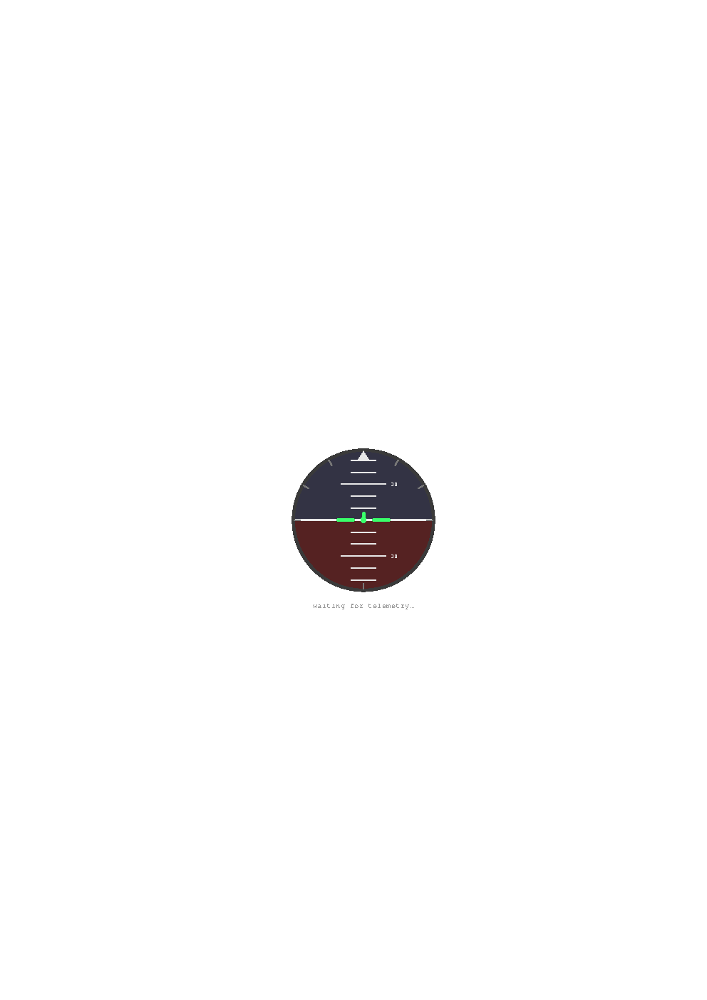

# IL-2 Great Battles — Artificial Horizon Overlay

A small transparent gauge that sits in the bottom-right corner of your screen
and shows live **bank** and **pitch** for your aircraft, driven by IL-2's
built-in UDP motion telemetry (the same feed SimShaker and motion rigs use).
It is click-through, never steals focus, and toggles with the same **H** key
that toggles the in-game HUD.

No mods, no injection, nothing touching game files except one config edit —
same category of tool as SimShaker.

---

## Requirements

- Windows 10/11
- IL-2 running in **borderless / windowed fullscreen** (in true exclusive
  fullscreen the overlay cannot draw over the game)

## Install (recommended)

Download `IL2HorizonOverlay-Setup.exe` from the
[Releases](https://github.com/blackfist666/il2-overlay-attitude/releases) page
and run it. No Python required — it installs a standalone `.exe`, adds a Start
Menu entry, and optionally a desktop shortcut. Launch it from the Start Menu
or desktop icon; everything below under "Setup" still applies (you still need
to enable telemetry in IL-2's `startup.cfg`).

To rebuild the installer yourself instead of using a release: `pyinstaller
IL2HorizonOverlay.spec` then compile `installer.iss` with
[Inno Setup](https://jrsoftware.org/isinfo.php). Requires Python 3.8+ and
`pip install pyinstaller` — only needed for building, not for running.

## Setup

**1. Enable telemetry in IL-2.** Edit `data/startup.cfg` inside your IL-2
install folder (e.g. `...\IL-2 Sturmovik Battle of Stalingrad\data\startup.cfg`)
and add:

```
[KEY = motiondevice]
addr = "127.0.0.1"
decimation = 1
enable = true
port = 4321
[END]
```

> Already running SimShaker or similar on port 4321? Either point this overlay
> at a different port (change `UDP_PORT` at the top of the script AND add a
> second motiondevice block is not supported by the game — instead let one app
> own the port, or change both apps to a shared forwarding setup). Simplest:
> pick a port nothing else uses and set it in both startup.cfg and the script.

**2. Run the overlay** (before or after launching the game, order doesn't
matter). If you used the installer, launch it from the Start Menu or desktop
shortcut. Running from source instead:

```
python il2_horizon_overlay.py
```

Double-clicking the .py works too if Python is associated. To run it without
a console window, rename it to `il2_horizon_overlay.pyw`.

**3. Fly.** The gauge shows "waiting for telemetry…" until you're in a
mission with a controllable aircraft, then comes alive at 50 Hz.

## Hotkeys

| Key      | Action |
|----------|--------|
| `H`      | Toggle overlay (mirrors IL-2's default HUD toggle) |
| `Alt+H`  | Also toggles it (mirrors "hide full interface")    |
| `F9`     | Overlay-only toggle — use this to re-sync if the game HUD and the overlay ever end up in opposite states |

The H-key mirroring is a global key listener, not a real link to the game —
if you rebound the HUD toggle in IL-2, either rebind it back, change `H_VK`
in the CONFIG section (virtual-key codes: https://learn.microsoft.com/en-us/windows/win32/inputdev/virtual-key-codes),
or set `SYNC_WITH_H_KEY = False` and just use F9.

Note: pressing H while typing in multiplayer chat will also toggle the
overlay. Known quirk of listening globally; F9 puts it back.

## Tuning

Everything lives in the CONFIG block at the top of the script:

- `GAUGE_SIZE`, `MARGIN_RIGHT`, `MARGIN_BOTTOM` — size and corner position
- `PX_PER_DEG` — pitch sensitivity of the ladder
- `INVERT_BANK` / `INVERT_PITCH` — flip these if the horizon moves the wrong
  way on your install (sign conventions untested against every game version)
- `SHOW_READOUT` — the numeric text under the gauge
- `UDP_PORT` — must match startup.cfg

## Multiplayer note

This reads a telemetry feed the game deliberately exposes and doesn't touch
game memory or files, so there's nothing for a server to detect or object to
technically. Whether an attitude indicator on an aircraft that historically
lacked one is in the spirit of a full-real server is a squadron-etiquette
question, not a technical one.

## How it works

- IL-2 broadcasts 44-byte UDP packets at 50 Hz: `packetID (0x494C0100)`,
  `tick`, then floats `yaw, pitch, roll, spinXYZ, accXYZ` — angles in radians.
  (Struct layout cribbed from PHARTGAMES/IL2SimFeedback, MIT licensed.)
- A background thread parses packets; the UI thread redraws a tkinter canvas
  at 50 fps.
- The window is borderless, chroma-key transparent, `WS_EX_TRANSPARENT`
  (click-through), `WS_EX_NOACTIVATE` (never takes focus), `WS_EX_TOOLWINDOW`
  (hidden from Alt-Tab), and re-asserts TOPMOST once a second because games
  like to steal it.

## Preview


